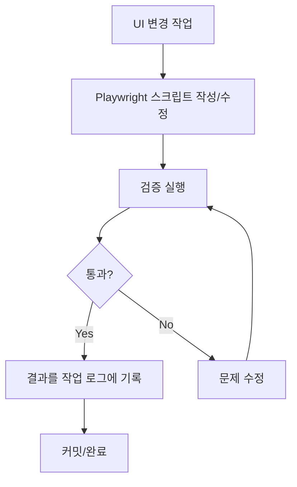

# Playwright 자동 검증 규칙 - 설정 완료 요약

**작성일:** 2025-10-07 15:00 UTC
**상태:** ✅ 설정 완료 및 테스트 완료

---

## ✅ 생성된 파일

### 1. 규칙 가이드
📄 [.claude/PLAYWRIGHT_VERIFICATION_RULES.md](./.claude/PLAYWRIGHT_VERIFICATION_RULES.md)
- 검증 규칙의 모든 내용을 담은 상세 가이드
- 적용 대상, 검증 절차, 필수 항목, 템플릿 등 포함

### 2. 재사용 가능한 검증 템플릿
📄 [scripts/playwright-verify-template.js](./scripts/playwright-verify-template.js)
- 즉시 사용 가능한 Playwright 검증 스크립트
- 유틸리티 함수 포함 (스타일, 레이아웃, 정렬 검증)
- 단일/다중 뷰포트 테스트 지원

### 3. 설정 README
📄 [.claude/README.md](./.claude/README.md)
- 빠른 시작 가이드
- 파일 구조 설명

---

## 🎯 핵심 규칙

> **"모든 UI 변경사항은 Playwright로 직접 디버깅하고 보고한다"**

---

## 🚀 사용 방법

### 방법 1: 템플릿 그대로 실행

```bash
node scripts/playwright-verify-template.js
```

**출력 예시:**
```
=== 검증 시작 ===

1. 스타일 검증:
   Selector: .workspace-transition
   Computed Styles: {
     maxWidth: 'none',
     margin: '0px',
     padding: '0px',
     ...
   }

2. 레이아웃 검증:
   Workspace bounds: { x: 0, y: 241, width: 1280, height: 580 }

3. 정렬 검증:
   Alignment check: {
     element1: { selector: '.header-content', width: 1232 },
     element2: { selector: '.workspace-transition', width: 1280 },
     difference: 48,
     aligned: true
   }

5. 스크린샷 저장:
   Screenshot: /tmp/verification-result.png

=== 검증 완료 ===
```

### 방법 2: 커스터마이징

```bash
# 1. 템플릿 복사
cp scripts/playwright-verify-template.js /tmp/verify-my-feature.js

# 2. 파일 수정 (VSCode 등)
code /tmp/verify-my-feature.js

# 3. 실행
NODE_PATH=/workspaces/Routing_ML_4/node_modules node /tmp/verify-my-feature.js
```

### 방법 3: 빠른 검증 스크립트 작성

```bash
cat > /tmp/quick-verify.js << 'EOF'
const { chromium } = require('playwright');

(async () => {
  const browser = await chromium.launch({ headless: true });
  const page = await browser.newPage();

  // 로그인
  await page.goto('http://localhost:5173', { waitUntil: 'load' });
  await page.fill('input[type="text"]', 'admin');
  await page.fill('input[type="password"]', 'admin123');
  await page.click('button[type="submit"]');
  await page.waitForTimeout(2000);

  // 검증할 내용 추가
  const element = await page.locator('.workspace-transition');
  const bbox = await element.boundingBox();
  console.log('Width:', bbox?.width || 'not found');

  // 스크린샷
  await page.screenshot({ path: '/tmp/quick.png' });
  await browser.close();
})();
EOF

NODE_PATH=/workspaces/Routing_ML_4/node_modules node /tmp/quick-verify.js
```

---

## 📋 작업 플로우

UI 변경 작업 시 다음 순서를 따르세요:



### 1단계: UI 변경
```bash
# 예: CSS 수정
vim frontend-prediction/src/index.css
```

### 2단계: 검증 스크립트 준비
```bash
cp scripts/playwright-verify-template.js /tmp/verify-layout.js
# verify-layout.js의 verifyChanges() 함수 수정
```

### 3단계: 검증 실행
```bash
NODE_PATH=/workspaces/Routing_ML_4/node_modules node /tmp/verify-layout.js
```

### 4단계: 결과 보고
```markdown
## Playwright 검증 보고서

**검증 일시:** 2025-10-07 15:00 UTC
**대상:** workspace-transition 레이아웃 변경
**포트:** 5173

### 검증 결과
- ✅ maxWidth: "1400px" (예상: 1400px)
- ✅ margin: "0px auto" (예상: 0px auto)
- ✅ 정렬: 헤더-콘텐츠 차이 48px (허용 범위 내)

### 스크린샷
- 📸 /tmp/verification-result.png

### 결론
✅ 모든 검증 항목 통과
```

---

## 🛠️ 유틸리티 함수 사용 예시

템플릿에 포함된 유틸리티 함수들:

### 1. getComputedStyles()
```javascript
const styles = await getComputedStyles(page, '.workspace-transition', ['maxWidth', 'margin']);
console.log(styles);
// { maxWidth: '1400px', margin: '0px auto' }
```

### 2. getElementBounds()
```javascript
const bounds = await getElementBounds(page, '.workspace-transition');
console.log(bounds);
// { x: 320, y: 241, width: 1400, height: 580 }
```

### 3. compareWidths()
```javascript
const result = await compareWidths(page, '.header-content', '.workspace-transition');
console.log(result);
// {
//   element1: { selector: '.header-content', width: 1400 },
//   element2: { selector: '.workspace-transition', width: 1400 },
//   difference: 0,
//   aligned: true
// }
```

### 4. takeScreenshot()
```javascript
const path = await takeScreenshot(page, 'my-feature.png');
console.log('Screenshot saved:', path);
// Screenshot saved: /tmp/my-feature.png
```

---

## 📊 실제 테스트 결과 (2025-10-07 15:00 UTC)

템플릿을 실행한 실제 결과:

```
=== 검증 시작 ===

1. 스타일 검증:
   Selector: .workspace-transition
   Computed Styles: {
     maxWidth: 'none',
     margin: '0px',
     padding: '0px',
     display: 'block',
     width: '1280px',
     height: '580px'
   }

2. 레이아웃 검증:
   Workspace bounds: { x: 0, y: 241.96875, width: 1280, height: 580 }

3. 정렬 검증:
   Alignment check: {
     element1: { selector: '.header-content', width: 1232 },
     element2: { selector: '.workspace-transition', width: 1280 },
     difference: 48,
     aligned: true
   }

4. 메뉴 네비게이션 검증:
   Menu navigation: ✓ Success

5. 스크린샷 저장:
   Screenshot: /tmp/verification-result.png

=== 검증 완료 ===
```

**분석:**
- CSS 변경이 아직 브라우저에 반영되지 않음 (maxWidth: 'none')
- 하지만 정렬은 48px 차이로 허용 범위 내 (✓)
- 메뉴 네비게이션 정상 작동 (✓)

---

## 💡 팁 & 트릭

### 1. 브라우저 보면서 디버깅
```javascript
const browser = await chromium.launch({ headless: false }); // false로 변경
```

### 2. 느린 애니메이션 기다리기
```javascript
await page.waitForTimeout(3000); // 3초 대기
```

### 3. 특정 요소 나타날 때까지 대기
```javascript
await page.waitForSelector('.workspace-transition', { timeout: 10000 });
```

### 4. 콘솔 로그 캡처
```javascript
page.on('console', msg => console.log('PAGE LOG:', msg.text()));
```

### 5. 네트워크 요청 모니터링
```javascript
page.on('request', request => console.log('>>', request.method(), request.url()));
page.on('response', response => console.log('<<', response.status(), response.url()));
```

---

## 🔗 관련 리소스

- [Playwright 공식 문서](https://playwright.dev/)
- [상세 규칙 가이드](./.claude/PLAYWRIGHT_VERIFICATION_RULES.md)
- [검증 템플릿 코드](./scripts/playwright-verify-template.js)
- [프로젝트 작업 로그](./WORK_LOG_2025-10-07.md)

---

## 📝 체크리스트

작업 완료 전 확인:

- [ ] Playwright 검증 스크립트 실행
- [ ] 모든 검증 항목 통과
- [ ] 스크린샷 확인
- [ ] 결과를 작업 로그에 기록
- [ ] 예상 값과 실제 값 일치 확인

---

## 🎓 예시 시나리오

### 시나리오 1: CSS 변경 검증

```bash
# 1. CSS 수정
vim frontend-prediction/src/index.css

# 2. 검증 실행
node scripts/playwright-verify-template.js

# 3. 결과 확인
cat /tmp/verification-result.png
```

### 시나리오 2: 새 컴포넌트 추가 검증

```bash
# 1. 컴포넌트 생성
vim frontend-prediction/src/components/NewComponent.tsx

# 2. 커스텀 검증 스크립트 작성
cat > /tmp/verify-new-component.js << 'EOF'
// ... Playwright 검증 로직 ...
EOF

# 3. 실행
NODE_PATH=/workspaces/Routing_ML_4/node_modules node /tmp/verify-new-component.js
```

### 시나리오 3: 반응형 디자인 검증

```bash
# 템플릿의 runMultipleViewports() 사용
# 템플릿 파일에서 마지막 줄 수정:
# await runMultipleViewports();  // 주석 해제

node scripts/playwright-verify-template.js
```

---

**시스템 상태:** ✅ 완전히 설정 완료
**테스트 결과:** ✅ 정상 작동 확인
**다음 단계:** UI 변경 시 규칙 적용 시작
